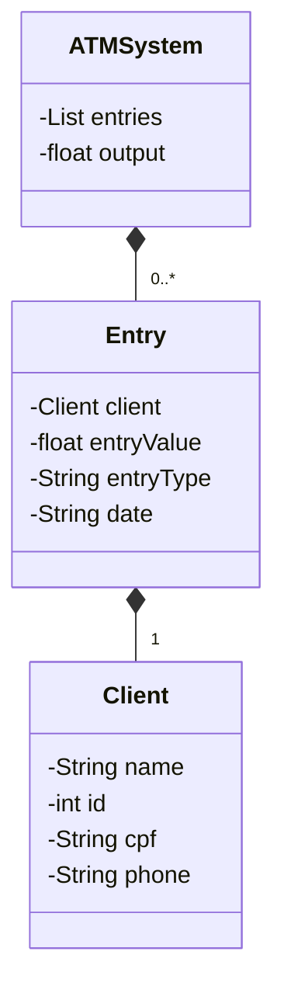

# Caixa Controller

## Diagrama de Classes Inicial

```mermaid
classDiagram
    class Client {
        -String name
        -int id
        -String cpf
        -String phone
    }

    class Entry {
        -Client client
        -float entryValue
        -String entryType
        -String date
    }

    class ATMSystem {
        -List<Entry> entries
        -float output
    }

    ATMSystem *-- "0..*" Entry
    Entry *-- "1" Client
```
